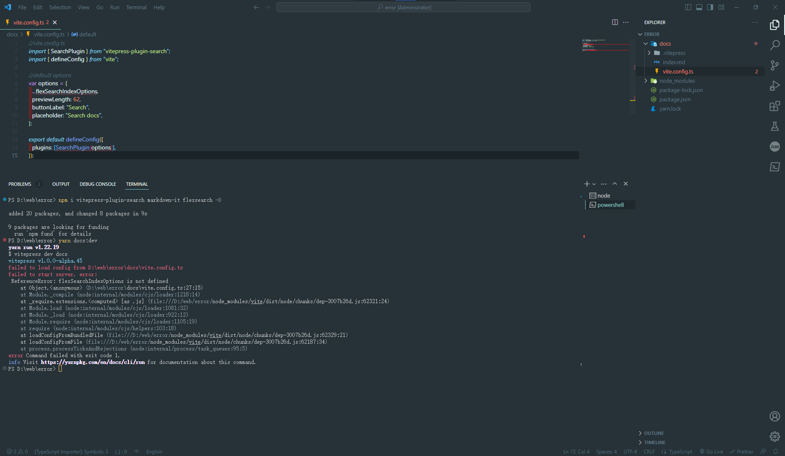
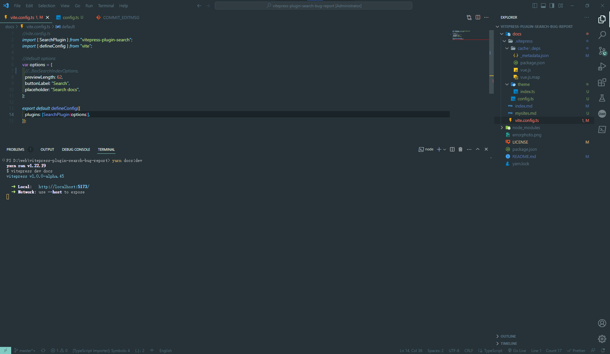
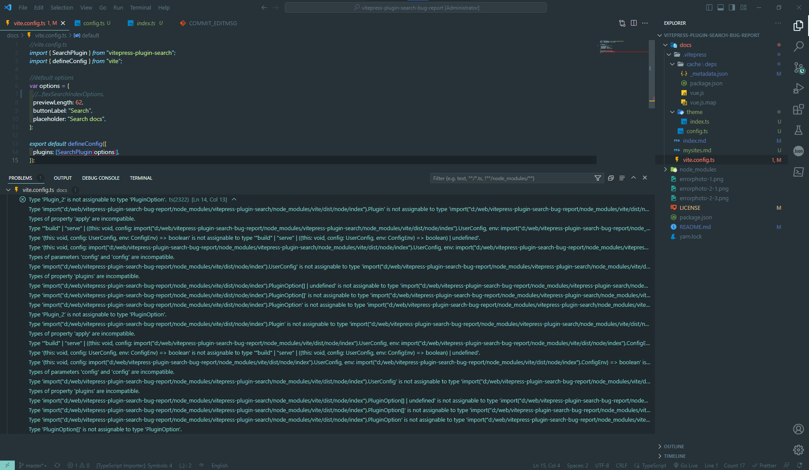
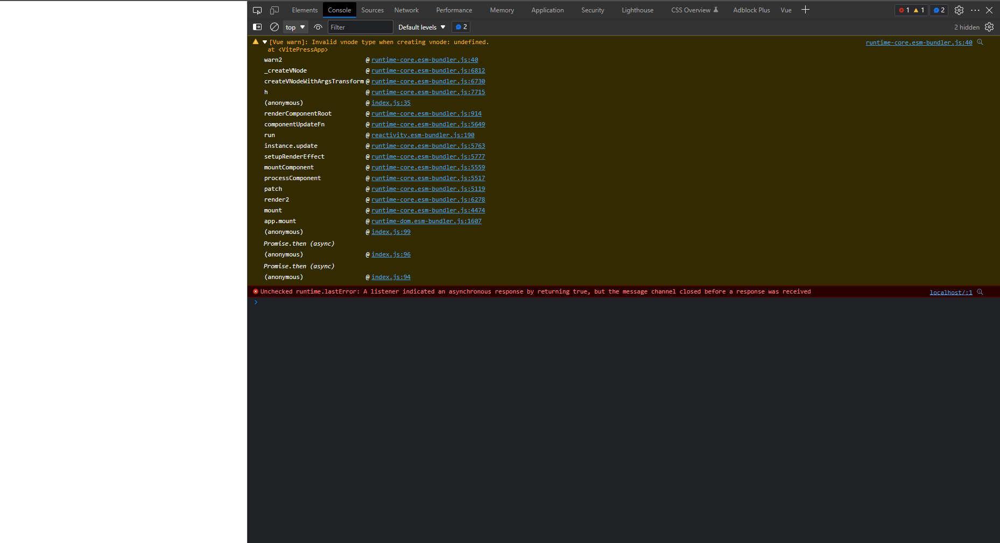
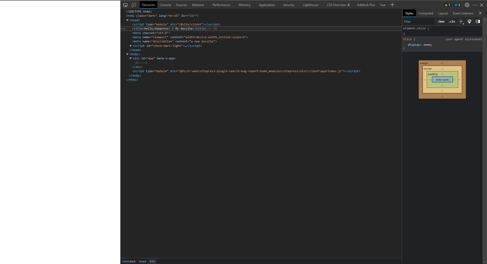
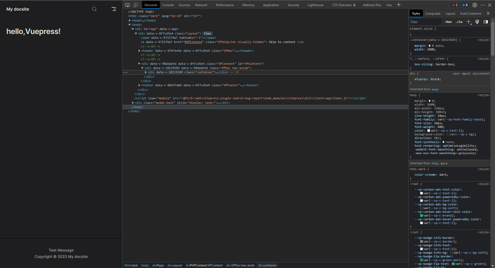

# vitepress-plugin-search Error report(Solved)

## **The current problem has been solved.**

[Issues Link](https://github.com/emersonbottero/vitepress-plugin-search/issues/53)

## Original error:



```typescript
//vite.config.ts
import { SearchPlugin } from "vitepress-plugin-search";
import { defineConfig } from "vite";//default options
var options = {
  //...flexSearchIndexOptions,(You can solve the problem here in the comments)
  previewLength: 62,
  buttonLabel: "Search",
  placeholder: "Search docs",
};
export default defineConfig({
  plugins: [SearchPlugin(options)],
});
```

## An error occurred when configuring vitepress again:

config:

```typescript
//Path /docs/.vitepress/theme/index.ts
export default {
    themeConfig: {
        //logo: '/logo.svg',
        //siteTitle: false
        lastUpdated: true,
        footer: {
            message: 'Test Message',
            copyright: 'Copyright © 2023 My docsite'
        }
    }
}
```

```typescript
//Path /docs/.vitepress/config.ts
export default {
    title: 'My docsite',
    description: 'a new docsite'
};
```

vite.config.ts

Can run but there seems to be a more Bug:
More errors and Page blank




```text
Type 'Plugin_2' is not assignable to type 'PluginOption'.
  Type 'import("d:/web/vitepress-plugin-search-bug-report/node_modules/vitepress-plugin-search/node_modules/vite/dist/node/index").Plugin' is not assignable to type 'import("d:/web/vitepress-plugin-search-bug-report/node_modules/vite/dist/node/index").Plugin'.
    Types of property 'apply' are incompatible.
      Type '"build" | "serve" | ((this: void, config: import("d:/web/vitepress-plugin-search-bug-report/node_modules/vitepress-plugin-search/node_modules/vite/dist/node/index").UserConfig, env: import("d:/web/vitepress-plugin-search-bug-report/node_modules/vitepress-plugin-search/node_modules/vite/dist/node/index").ConfigEnv) =...' is not assignable to type '"build" | "serve" | ((this: void, config: import("d:/web/vitepress-plugin-search-bug-report/node_modules/vite/dist/node/index").UserConfig, env: import("d:/web/vitepress-plugin-search-bug-report/node_modules/vite/dist/node/index").ConfigEnv) => boolean) | undefined'.
        Type '(this: void, config: UserConfig, env: ConfigEnv) => boolean' is not assignable to type '"build" | "serve" | ((this: void, config: UserConfig, env: ConfigEnv) => boolean) | undefined'.
          Type '(this: void, config: import("d:/web/vitepress-plugin-search-bug-report/node_modules/vitepress-plugin-search/node_modules/vite/dist/node/index").UserConfig, env: import("d:/web/vitepress-plugin-search-bug-report/node_modules/vitepress-plugin-search/node_modules/vite/dist/node/index").ConfigEnv) => boolean' is not assignable to type '(this: void, config: import("d:/web/vitepress-plugin-search-bug-report/node_modules/vite/dist/node/index").UserConfig, env: import("d:/web/vitepress-plugin-search-bug-report/node_modules/vite/dist/node/index").ConfigEnv) => boolean'.
            Types of parameters 'config' and 'config' are incompatible.
              Type 'import("d:/web/vitepress-plugin-search-bug-report/node_modules/vite/dist/node/index").UserConfig' is not assignable to type 'import("d:/web/vitepress-plugin-search-bug-report/node_modules/vitepress-plugin-search/node_modules/vite/dist/node/index").UserConfig'.
                Types of property 'plugins' are incompatible.
                  Type 'import("d:/web/vitepress-plugin-search-bug-report/node_modules/vite/dist/node/index").PluginOption[] | undefined' is not assignable to type 'import("d:/web/vitepress-plugin-search-bug-report/node_modules/vitepress-plugin-search/node_modules/vite/dist/node/index").PluginOption[] | undefined'.
                    Type 'import("d:/web/vitepress-plugin-search-bug-report/node_modules/vite/dist/node/index").PluginOption[]' is not assignable to type 'import("d:/web/vitepress-plugin-search-bug-report/node_modules/vitepress-plugin-search/node_modules/vite/dist/node/index").PluginOption[]'.
                      Type 'import("d:/web/vitepress-plugin-search-bug-report/node_modules/vite/dist/node/index").PluginOption' is not assignable to type 'import("d:/web/vitepress-plugin-search-bug-report/node_modules/vitepress-plugin-search/node_modules/vite/dist/node/index").PluginOption'.
                        Type 'Plugin_2' is not assignable to type 'PluginOption'.
                          Type 'import("d:/web/vitepress-plugin-search-bug-report/node_modules/vite/dist/node/index").Plugin' is not assignable to type 'import("d:/web/vitepress-plugin-search-bug-report/node_modules/vitepress-plugin-search/node_modules/vite/dist/node/index").Plugin'.
                            Types of property 'apply' are incompatible.
                              Type '"build" | "serve" | ((this: void, config: import("d:/web/vitepress-plugin-search-bug-report/node_modules/vite/dist/node/index").UserConfig, env: import("d:/web/vitepress-plugin-search-bug-report/node_modules/vite/dist/node/index").ConfigEnv) => boolean) | undefined' is not assignable to type '"build" | "serve" | ((this: void, config: import("d:/web/vitepress-plugin-search-bug-report/node_modules/vitepress-plugin-search/node_modules/vite/dist/node/index").UserConfig, env: import("d:/web/vitepress-plugin-search-bug-report/node_modules/vitepress-plugin-search/node_modules/vite/dist/node/index").ConfigEnv) =...'.
                                Type '(this: void, config: UserConfig, env: ConfigEnv) => boolean' is not assignable to type '"build" | "serve" | ((this: void, config: UserConfig, env: ConfigEnv) => boolean) | undefined'.
                                  Type '(this: void, config: import("d:/web/vitepress-plugin-search-bug-report/node_modules/vite/dist/node/index").UserConfig, env: import("d:/web/vitepress-plugin-search-bug-report/node_modules/vite/dist/node/index").ConfigEnv) => boolean' is not assignable to type '(this: void, config: import("d:/web/vitepress-plugin-search-bug-report/node_modules/vitepress-plugin-search/node_modules/vite/dist/node/index").UserConfig, env: import("d:/web/vitepress-plugin-search-bug-report/node_modules/vitepress-plugin-search/node_modules/vite/dist/node/index").ConfigEnv) => boolean'.
                                    Types of parameters 'config' and 'config' are incompatible.
                                      Type 'import("d:/web/vitepress-plugin-search-bug-report/node_modules/vitepress-plugin-search/node_modules/vite/dist/node/index").UserConfig' is not assignable to type 'import("d:/web/vitepress-plugin-search-bug-report/node_modules/vite/dist/node/index").UserConfig'.
                                        Types of property 'plugins' are incompatible.
                                          Type 'import("d:/web/vitepress-plugin-search-bug-report/node_modules/vitepress-plugin-search/node_modules/vite/dist/node/index").PluginOption[] | undefined' is not assignable to type 'import("d:/web/vitepress-plugin-search-bug-report/node_modules/vite/dist/node/index").PluginOption[] | undefined'.
                                            Type 'import("d:/web/vitepress-plugin-search-bug-report/node_modules/vitepress-plugin-search/node_modules/vite/dist/node/index").PluginOption[]' is not assignable to type 'import("d:/web/vitepress-plugin-search-bug-report/node_modules/vite/dist/node/index").PluginOption[]'.
                                              Type 'import("d:/web/vitepress-plugin-search-bug-report/node_modules/vitepress-plugin-search/node_modules/vite/dist/node/index").PluginOption' is not assignable to type 'import("d:/web/vitepress-plugin-search-bug-report/node_modules/vite/dist/node/index").PluginOption'.
                                                Type 'PluginOption[]' is not assignable to type 'PluginOption'.
```

## Final solution

> leave only the `config.js` file inside .vitepress
> 
> remove `node_modules` and `package-lock.json`
> `npm i`
> `npm run docs:dev`



