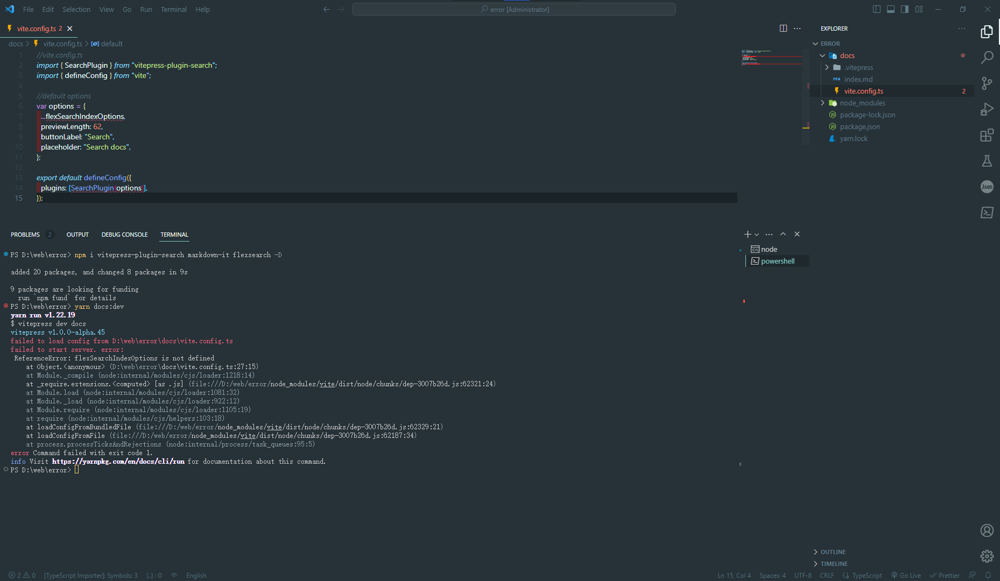

# vitepress-plugin-search Error report

The configuration provided by vitepress-plugin-search is currently incompatible and does not work.

I ran the basic configuration of the page in the way provided by the official website of vuepress,
and then installed the dependency and configuration according to the command provided by the repository.

The attempt failed and two errors were reported

